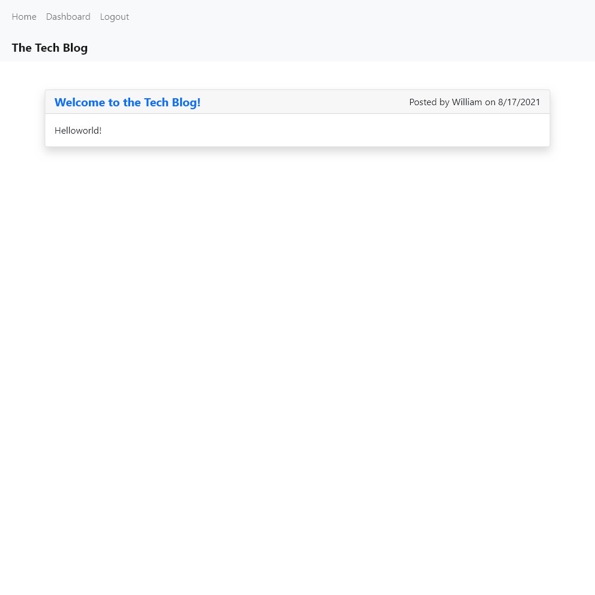

# The Tech Blog 

## Description
This app is a CMS-sytle blog site similar to a Wordpress site. The app follows the MVC paradigm in its architectural structure, using Handlebars.js as the templating language, Sequelize as the ORM, and the express-session npm package for authentication.

## Table of Contents
- [Installation](#installation)
- [Usage](#usage)
- [Link](#Link)

- [Contribute](#contribute)

- [Questions](#questions)

## Installation
THIS PROCESS REQUIRES MYSQL INSTALLED LOCALLY. Run "npm i" to install all dependencies, "source ./db/schema.sql" in MySQL to create the database, "npm run seed" to seed the test data, then "npm start" to initiate the server and navigate to "[localhost:3001/](localhost:3001/)" to get start.

## Usage
This app is a CMS-sytle blog site where developers can publish their blog posts and comment on other developers' posts as well.

## Link
[The Tech Blog running on Heroku](https://ywk-tech-blog.herokuapp.com)
[The Tech Blog GitHub Repo](https://github.com/ywkuo227/tech-blog)

## Contribute
If you would like to contribute to this app, please feel free to contact me via my email in Questions section.

## Questions
GitHub: [ywkuo227's GitHub](https://github.com/ywkuo227)

Email: [ywkuo@outlook.com](mailto:ywkuo@outlook.com)